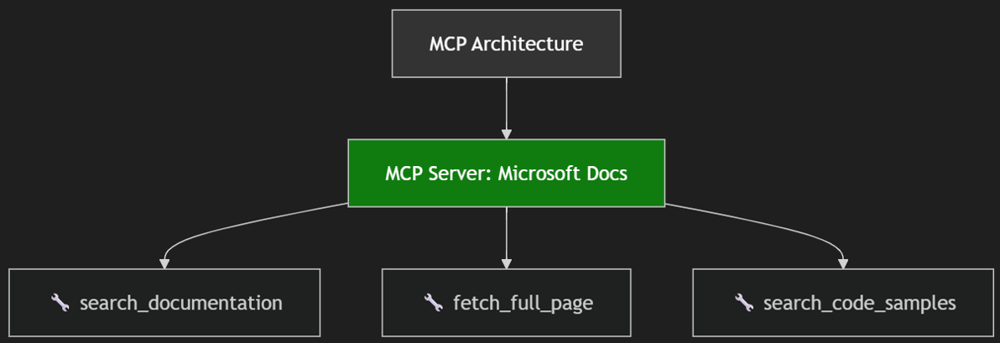

# AI Assisted Software Development

## John Michael Miller

Senior Software Engineer at Code Staffing

Played roles of developer, architect, devops engineer, platform engineer, test architect, release manager

AI/ML Enthusiast and advocate for Effectively using AI to write code

- LinkedIn: `www.linkedin.com/in/johnmichaelmiller`
- Email: `john.miller@codestaffing.com`
- Blog: `https://codemag.com/blog/AIPractitioner`

---

## Day Two & Three

Working Effectively with Legacy Code, with AI assistance

* Going from Brownfield to Evergreen

::: notes
Day Two: Focus on legacy code manipulation with Copilot, instruction files, and safe editing practices.

preparing for exercises
cd "c:\git\blogcode\Zeus.Code.Presents“
git switch main
git branch --list
git branch -D gpt4o
git branch -D sonnet4
git branch -D fixes
git clean -fdx
clear
git branch --list

close all editors
clear terminal
new chat
:::

---

## But first...

https://githubuniverse.com/

October 28-29
San Francisco, CA
In-person and virtual

"C:\Users\JohnM\Downloads\hero-1280x720.mp4"

---

## Agenda -- Evergreen Development

- Overview
  - What is and isn't legacy code
  - What is Evergreen Code
- Before engaging Copilot
- Managing Copilot Context
  - Instructions, ChatModes, and Prompts
- Read Only Techniques
  - explain, review, document, test
- Modifying legacy code with AI assistance
- Managing Change Risk
  - small changes, refactoring, safety nets
- Exercises

::: notes
Preview themes: understanding legacy code, instruction files, and exercises focused on safe edits.
:::

---

## Overview

**Course Objective**: Understand how to work with AI in modifying legacy codebases

**Course Perspective**: Focus on AI assistance and assisting the AI

- Less emphasis on syntax
- More emphasis on architecture, design, code quality, refactoring
- Moving faster with less risk

**Must Read**: [Working Effectively with Legacy Code](https://archive.org/details/working-effectively-with-legacy-code)

::: notes
State course objective: practical skills for using Copilot effectively on legacy codebases.
Part 1: Understanding legacy code and its challenges
Part 2: Techniques for safely modifying legacy code with AI assistance
:::

---

## Exercise #1.1 -- Fork the repos

**Objective**: Fork the course repos

- Search GitHub for
  - AI-Assisted-Software-Development
- Fork the repo
  - This will create a personal copy under your GitHub account
  - You can make changes without affecting the original repo

---

## Exercise #1.2 -- Fork the target repo

**Objective**: Fork the repo for the legacy code exercises

- Find a repo that could use some help
  - Choose a language you are familiar with
  - A personal project is cool, but a project you are not familiar with is better
  - Don't use a company repo
  - Fork it
    - It allows you to experiment without affecting the original codebase

**Prompt**: I'm looking for a small GitHub Golang project that has a lot of open issues. Can you recommend one?

::: notes
Speaker Notes:

A zip with the slides, examples, demos will be provided after the course
:::

---

## What is legacy code

- No universally accepted definition
- Easier to define what is _not_ legacy code

::: notes
Try this in quick chat:

- "what are three definitions of legacy code?"
- "what are 10 definitions of legacy code?"
- "what are 25 definitions of legacy code?"

Ask the audience: "Who recognizes these definitions in their work?"

Encourage discussion about their experiences with legacy code.
:::

---

## What is not legacy code

- All codebases start as greenfield
- Few codebases are evergreen

<!--
Try this in quick chat:
what are three definitions of code that is not legacy?
-->

::: notes
Explain greenfield characteristics and why "not legacy" is rare at scale.
:::

---

## Codebases degrade over time

Due to changes in:

- Technology
- Practices
- People
- Business rules
- Workflows
- Architecture

::: notes
Discuss drivers of decay (tech, people, rules) and give a brief example.
:::

---

## What is Evergreen Code

- Evergreen code actively resists technical debt
- Evergreen ≠ Legacy; everything else is
- Evergreen is the goal
  - If we were to write all over again, it would turn out just like it is

::: notes
Describe evergreen goals: maintainability, minimal debt, and consistent patterns.
:::

---

## Legacy code should instill respect not fear

- It works - Don't break it!
- It works - Well-tested (by users)
- It works - It is, what it is
  - "You get what you get and you don't throw a fit"

::: notes
Emphasize safety-first approach: back up, test, and validate before large changes.
:::

---

## Prelude -- before engaging Copilot

- Have a strategy for backing out of changes
  - Branching, Commit SHA, Archiving, Zipping
- Have a strategy for testing the code
  - No matter who or what wrote it
  - You need to have confidence that your test automation will catch issues before they reach production
  - If you don't have that confidence, stop and build it first
- Have a strategy for reviewing changes
  - Peer review, AI review, Static analysis
  - You are going to be reviewing a lot of code. Make sure you have a plan to do it effectively
- Change sets as small as possible
  - Make incremental changes and validate frequently
  - AI can get carried away. Don't let it.

::: notes
Checklist: backups, testing strategy, and rollback plan before using AI to modify critical code.
:::

---

## Managing Copilot

- Treat Copilot as a highly skilled, junior developer who needs effective management to succeed
- Clear instructions + careful review = great outcomes

::: notes
Treat Copilot as a junior dev: give clear tasks, review output, and enforce style guidelines.
:::

---

## Managing Context

- The importance of context
  - Too little
  - Too much
- Prompts
  - Crafting effective prompts
  - Prompt engineering
- Adding context
  - Instructions markdown
  - File-based custom instructions, automatic context injection, instruction scopes, structure and authoring best practices, structure and authoring best practices
- Custom chat modes
  - Mode definition, tool integration, quick mode switching, workspace and user scope, persona-driven workflows, enhanced productivity and consistency

---

## Awareness

- Copilot has a limited context window (token budget)
- Long prompts/files can push useful info out of scope
- Premium usage can be tracked monthly (dashboard)

---

## Prompt Design

- Keep prompts short and modular
- Use step-by-step requests
- Reuse prompt files/templates
- Reset chat if answers drift

---

## Context Management

- Use #-mentions to pull in files, folders, or symbols
- Leverage Spaces or Knowledge Bases for docs
- Close irrelevant tabs to reduce noise

---

## Monitoring

- Premium Request Dashboard → usage reports
- Token Estimation Tools (e.g., OpenAI Tokenizer)
- Watch for off-topic replies = context overflow

---

## Coming Soon

- Real-time token counters (requested)
- Context usage indicators (progress bars, % left)

---

## Key Takeaways
- **Claude Sonnet 4.5** → best for ultra-long context (200k+)
- **GPT-5** → strong reasoning + 128k input / 16k output
- **Copilot Chat (GPT-4o)** → 64k tokens, tuned for IDE workflows
- Model choice = context size + reasoning style trade-off

---

## MCP Servers and Tools

---

## Adding Context - Tools

- Configure Tools…
- Built-in and not
- Selecting and Unselecting Tools
  - 128 Tool limit

---

## Raising the Bar -- with Instruction Files

- What are instruction files?
- Provide context and guidance to Copilot and
- Can include:
  - Project-specific instructions
  - Tech-specific instructions
  - Standards and practices
- They need to be consistent and not contradictory

::: notes
Explain instruction files purpose and show examples of project-level guidance.
:::

---

## Instruction File Locations

- Personal - `$home\.github\copilot-instructions.md`
- Project - .github\instructions
- File names should be `*.instructions.md`

::: notes
Point out file locations and naming conventions; advise on consistent team distribution.
:::

---

## Meta Instructions

| Instructions File                  | Description                                              |
| ---------------------------------- | -------------------------------------------------------- |
| ai-assisted-output.instructions.md | Instructions for generating AI-assisted output           |
| copilot-instructions.md            | Instructions for using Copilot effectively               |
| instruction-prompt.instructions.md | Instructions for creating effective prompts              |
| prompt-file.instructions.md        | Instructions for prompt files that generate instructions |

Copy these files into the .github/instructions folder of your project to guide Copilot in the creation of prompts that create instruction files.

---

# AI-Assisted Output Policy — At a Glance

- Purpose: enforce provenance for all AI-assisted artifacts
- Requires: embedded YAML front matter (ai_generated, model, operator, chat_id, ai_log, timestamps)
- Workflow: new chat → `ai-logs/yyyy/mm/dd/<chat-id>/conversation.md` + `summary.md`
- Enforcement: CI/PR checks should fail files with `ai_generated: true` missing `chat_id` or `ai_log`

<footer style="font-size:0.8em">See: .github/instructions/ai-assisted-output.instructions.md</footer>

---

# GitHub Copilot Instructions — At a Glance

- Scope: Guidance for GitHub Copilot usage and AI provenance across the repo
- Model rule: always use underlying model format "provider/model@version"
- Metadata: embed YAML front matter (ai_generated, model, operator, chat_id, prompt, started, ended, task_durations, total_duration, ai_log, source)
- Chat/logging: New chat → new ai-logs/yyyy/mm/dd/<chat-id>/conversation.md + summary.md
- Post-creation: update ai-logs, create summary.md, and add README entry for notable artifacts
- CI check: fail PRs when ai_generated artifacts lack chat_id or ai_log or referenced ai_log missing

<footer style="font-size:0.8em">See: .github/instructions/copilot-instructions.md</footer>

## Generating the Prompt for Evergreen Software Development

**Meta Prompt**: Create a prompt file that generates an instruction file for evergreen software development

- Keep `main` buildable, secure, releasable
- Automate dependency updates & CI (Dependabot, SCA)
- Merge small, frequent changes; pin and monitor deps
- PR checklist: CI green, security review, changelog
- Enforcement: GitHub Action "Evergreen check" (deps + tests)

---

## Generating the Evergreen Instruction Files

**Prompt**: #file:create-evergreen-instructions.prompt.md create the instruction file for evergreen software development

- Prompts to generate instructions
  - Instructions on generating instruction files
- Use current codebase as context
- Keeping instruction files fresh
- Prompts for updates
- Copilot suggestions based on codebase changes

::: notes
Show prompts and workflow to generate and maintain instruction files with Copilot.
:::

---

## Meta Prompts

---

## Exercise #3 -- Create Instruction Files

**Objective**: Create instruction files manually and with Copilot assistance

- Create instructions for:
  - Business rules
  - Workflows
  - Purpose
  - Tech stack
  - Architecture
- Use Copilot to generate instruction files using the codebase

- **Bonus**
- Review for errors, omissions and inconsistencies
- Ask Copilot for updates instructions based on tech/practice changes

::: notes
Task: Author then use Copilot to refine; review for inconsistencies and policy gaps.
:::

---

# Day Three -- Legacy Development

---

## But first...

Installing the Azure DevOps MCP Gallery Extension

- Enable MCP Gallery in VS Code Settings
  - `vscode://settings/chat.mcp.gallery.enabled`
- Search extensions for `@mcp azure devops`

---

## Understanding legacy code

- Generating documentation
- Update README files
- Generate architecture diagrams
- Identify and explain complex or confusing code

::: notes
Demonstrate generating architecture summaries, README updates, and code explanations with AI.
:::

---

## Exercise #4 -- Understanding legacy code

**Objective**: Create documentation for a legacy project using Copilot.

- Update or create:
  - Development guide
  - Deployment guide
  - README
  - Architecture diagrams
- Execute prompts to update documentation
- Review for errors and omissions
- **Bonus**: Use another model to review the documentation

::: notes
Task instructions: use Copilot to produce docs, run quick verification, and iterate.
:::

---

## Meta-Instructions

---

## Keeping Code Evergreen

**Prompt**:

- Create an instruction file for an evergreen project. put it in the .github\instructions folder. It should be technology agnostic
- Create an instruction file for an evergreen golang backend. put it in the .github\instructions folder. It should be technology focus on golang and not repeat instructions in the #file:evergreen.instructions.md
- Review the code in the Fundamentals\examples\.sav.calculator folder and create issues for bringing the in compliance with the instructions. Prioritize and categorize the issues.

---

## Test automation

- Unit, integration, E2E, and other tests
- Generating tests
- How many tests are enough?

::: notes
Focus: building safety nets (linting, tests) and using AI for improvements without breaking behavior.
:::

---

## Exercise #5 -- Generate Tests

Objective: Same as earlier---focus on test creation and review.

**Bonus**: Use another model to review the tests

::: notes
Generate unit and integration tests with Copilot, then run to validate behavior and coverage.
:::

---

## Identifying Instruction Compliance Gaps

- Compare current implementation to instructions
- Generate issues from gaps
- Identify low-hanging fruit

::: notes
Show how to compare implementation against instruction files and produce actionable issues.
:::

---

## Exercise #6 -- Identify Gaps

**Objective**: Use Copilot to compare the implementation with the instruction files.

- Create prompt to identify deviations
- Review response

**Bonus**: Generate GitHub issues from findings

<!-- Note: It's better to fork the repo than clone -->

::: notes
Hands-on: craft prompts to find deviations and export findings to tickets for triage.
:::

---

## Exercise #7 -- Address a Compliance Gap

**Objective**: Create a plan to address a deviation found in Exercise #6.

- Ask Copilot to create a remediation plan
- Review the plan

**Bonus**: Ask a different model to review the plan

::: notes
Create a remediation plan, implement in a branch, and validate with tests and reviews.
:::

---

## Comparing Implementations

- Implement the same change with multiple models
- Ask Copilot to summarize pros and cons

::: notes
Run the same change using multiple models and compare outcomes for quality and maintainability.
:::

---

## Exercise #8 -- Compare Implementations

**Objective**: Use two models to implement a change and compare results.

- Create branches for each model
- Implement fix using different models
- Compare implementations

**Bonus**: Ask a second model to compare and report pros/cons

::: notes
Practical: create branches per model, implement changes, run comparisons, and document differences.
:::

---

## Wrap-Up and Open Q&A

- Review the day's learning outcomes.
- Address questions or concerns.
- Discuss next steps and future learning opportunities.

::: notes
Summarize key takeaways, next steps, and open the floor for questions and feedback.
:::
