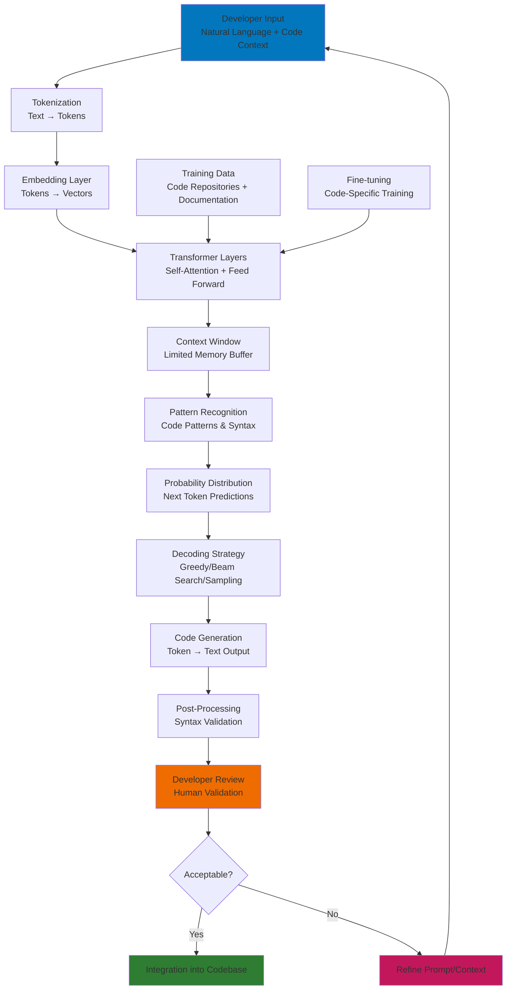

```mermaid
graph TD
    A[Developer Input<br/>Natural Language + Code Context] --> B[Tokenization<br/>Text → Tokens]
    B --> C[Embedding Layer<br/>Tokens → Vectors]
    C --> D[Transformer Layers<br/>Self-Attention + Feed Forward]
    D --> E[Context Window<br/>Limited Memory Buffer]
    E --> F[Pattern Recognition<br/>Code Patterns & Syntax]
    F --> G[Probability Distribution<br/>Next Token Predictions]
    G --> H[Decoding Strategy<br/>Greedy/Beam Search/Sampling]
    H --> I[Code Generation<br/>Token → Text Output]
    I --> J[Post-Processing<br/>Syntax Validation]
    J --> K[Developer Review<br/>Human Validation]

    L[Training Data<br/>Code Repositories + Documentation] --> D
    M[Fine-tuning<br/>Code-Specific Training] --> D

    K --> N{Acceptable?}
    N -->|Yes| O[Integration into Codebase]
    N -->|No| P[Refine Prompt/Context]
    P --> A

    style A fill:#0277bd
    style K fill:#ef6c00
    style O fill:#2e7d32
    style P fill:#c2185b
```
