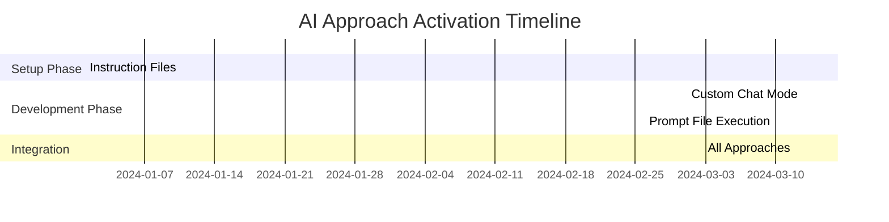

# AI-Assisted Development Approaches

## Instruction Files vs Prompt Files vs Custom Chat Modes

**Comparing Three Key Approaches for AI-Guided Software Development**

---

## Agenda

- **Overview of AI Development Approaches**
- **Instruction Files Deep Dive**
- **Prompt Files Deep Dive**
- **Custom Chat Modes Deep Dive**
- **Side-by-Side Comparison**
- **When to Use Each Approach**
- **Best Practices & Integration**

---

## AI Development Approaches Overview

### Three Primary Methods for Guiding AI Assistance

1. **Instruction Files** → Persistent behavioral guidelines
2. **Prompt Files** → Executable task templates
3. **Custom Chat Modes** → Specialized conversational contexts

Each serves different purposes in the AI-assisted workflow

---

# Instruction Files

## Persistent AI Behavioral Guidelines

---

## What Are Instruction Files?

### Definition

- **Persistent configuration files** that define AI behavior patterns
- Applied automatically across multiple interactions
- Establish consistent working standards and constraints

### Key Characteristics

- **Scope**: Repository-wide or context-specific
- **Persistence**: Active across all relevant AI interactions
- **Purpose**: Define "how" AI should work, not "what" to do

---

## Instruction File Structure

```markdown
---
description: Azure best practices for AI development
applyTo: "**" # File pattern scope
---

# Core Instructions

- Use Azure Tools when handling Azure requests
- Follow security best practices
- Implement proper error handling
- Generate comprehensive documentation

# Code Generation Rules

- Write tests before implementation
- Use dependency injection patterns
- Follow naming conventions
- Include proper logging
```

---

## Instruction Files: Use Cases

### Perfect For:

- **Coding Standards** → Consistent style across projects
- **Security Policies** → Enforce security practices
- **Quality Gates** → Define testing and review requirements
- **Technology Constraints** → Specify approved frameworks/tools

### Examples:

- `azure-development.instructions.md`
- `testing-standards.instructions.md`
- `security-requirements.instructions.md`

---

# Prompt Files

## Executable Task Templates

---

## What Are Prompt Files?

### Definition

- **Structured templates** for specific, repeatable tasks
- Contain detailed instructions for particular objectives
- Designed for execution in AI chat interfaces

### Key Characteristics

- **Scope**: Single, focused task or workflow
- **Execution**: Run on-demand when needed
- **Purpose**: Define "what" to accomplish with specific steps

---

## Prompt File Structure

```yaml
---
mode: agent
model: "anthropic/claude-3.5-sonnet@2024-10-22"
tools: ["create", "edit", "read"]
description: Generate comprehensive API documentation
prompt_metadata:
  id: generate-api-docs
  title: API Documentation Generator
  category: documentation
  output_format: markdown
---

# Generate API Documentation

## Context
Create comprehensive API documentation from code analysis...

## Requirements
1. Analyze existing API endpoints
2. Generate OpenAPI specifications
3. Create developer-friendly guides
4. Include example requests/responses

## Deliverable
Generate `docs/api/` folder with complete documentation...
```

---

## Prompt Files: Use Cases

### Perfect For:

- **Code Generation** → Create specific components/features
- **Documentation** → Generate standardized docs
- **Analysis Tasks** → Code reviews, security audits
- **Refactoring** → Structured code improvements

### Examples:

- `implement-user-authentication.prompt.md`
- `generate-test-suite.prompt.md`
- `create-deployment-pipeline.prompt.md`

---

# Custom Chat Modes

## Specialized Conversational Contexts

---

## What Are Custom Chat Modes?

### Definition

- **Preconfigured AI personalities** for specific domains
- Combine behavioral rules with specialized knowledge
- Provide contextual expertise for particular scenarios

### Key Characteristics

- **Scope**: Domain or role-specific interactions
- **Context**: Rich background knowledge and constraints
- **Purpose**: Act as specialized "AI expert" for conversations

---

## Custom Chat Mode Examples

### DevOps Engineer Mode

```yaml
role: "Senior DevOps Engineer"
expertise:
  - CI/CD pipelines
  - Infrastructure as Code
  - Container orchestration
  - Monitoring and observability

behavior:
  - Focus on scalability and reliability
  - Recommend industry best practices
  - Consider security implications
  - Suggest automation opportunities
```

---

## Custom Chat Modes: Use Cases

### Perfect For:

- **Domain Expertise** → Get specialized knowledge
- **Role-Playing** → AI acts as specific professional
- **Context Switching** → Different perspectives on same problem
- **Learning** → Educational conversations with expert personas

### Examples:

- **Security Architect Mode** → Focus on security concerns
- **Database Expert Mode** → Optimize data architecture
- **UX Designer Mode** → Human-centered design guidance

---

# Side-by-Side Comparison

---

## Comparison Matrix

| Aspect          | Instruction Files      | Prompt Files           | Custom Chat Modes             |
| --------------- | ---------------------- | ---------------------- | ----------------------------- |
| **Purpose**     | Define AI behavior     | Execute specific tasks | Provide specialized expertise |
| **Scope**       | Repository-wide        | Single task/workflow   | Conversational context        |
| **Persistence** | Always active          | On-demand execution    | Session-based                 |
| **Reusability** | High (across projects) | High (task templates)  | Medium (role-specific)        |
| **Complexity**  | Simple rules           | Detailed procedures    | Rich contextual knowledge     |

---

## Execution Timeline



---

# When to Use Each Approach

---

## Decision Framework

### Use **Instruction Files** When:

- ✅ Need consistent behavior across all AI interactions
- ✅ Enforcing organizational standards/policies
- ✅ Setting up coding conventions and quality gates
- ✅ Defining security or compliance requirements

### Use **Prompt Files** When:

- ✅ Have repeatable, structured tasks
- ✅ Need detailed step-by-step execution
- ✅ Want to standardize complex workflows
- ✅ Building reusable automation templates

---

## Decision Framework (Continued)

### Use **Custom Chat Modes** When:

- ✅ Need specialized domain expertise
- ✅ Want AI to act as specific professional role
- ✅ Exploring problems from different perspectives
- ✅ Learning or getting advice in specific areas

### **Combine Approaches** When:

- ✅ Building comprehensive AI-assisted workflows
- ✅ Need both consistency AND specialization
- ✅ Managing complex, multi-phase projects

---

# Integration Patterns

---

## Layered Integration Approach

```
┌─────────────────────────────────────┐
│     Custom Chat Mode               │  ← Conversational Context
│  (Security Architect Persona)      │
├─────────────────────────────────────┤
│     Prompt Files                   │  ← Task Execution
│  (Security Audit Template)         │
├─────────────────────────────────────┤
│     Instruction Files              │  ← Base Behavior
│  (Security Standards, Coding Rules) │
└─────────────────────────────────────┘
```

**Result**: Specialized security expert using standardized processes with consistent quality standards

---

## Real-World Integration Example

### Scenario: Implementing User Authentication

1. **Instruction Files** provide:

   - Security coding standards
   - Testing requirements
   - Documentation standards

2. **Prompt File** executes:

   - "Implement OAuth2 Authentication System"
   - Step-by-step implementation guide

3. **Custom Chat Mode** offers:
   - Security Architect expertise
   - Best practice recommendations
   - Threat modeling insights

---

# Best Practices

---

## Instruction Files Best Practices

### ✅ Do This:

- Keep instructions clear and actionable
- Use file patterns (`applyTo: '**'`) for broad scope
- Version control and document changes
- Test instruction effectiveness regularly

### ❌ Avoid This:

- Overly complex or contradictory rules
- Too many instructions (cognitive overload)
- Instructions that conflict with prompt files
- Hardcoded values instead of parameters

---

## Prompt Files Best Practices

### ✅ Do This:

- Include comprehensive metadata
- Provide clear context and requirements
- Specify expected deliverables
- Include verification steps

### ❌ Avoid This:

- Vague or ambiguous instructions
- Missing prerequisite information
- No success criteria defined
- Overly complex single prompts (break them down)

---

## Custom Chat Modes Best Practices

### ✅ Do This:

- Define clear expertise boundaries
- Provide rich contextual background
- Establish consistent personality/voice
- Include relevant constraints and preferences

### ❌ Avoid This:

- Conflicting expertise claims
- Too broad or unfocused roles
- Personality that conflicts with task needs
- Missing essential domain knowledge

---

# Practical Implementation

---

## Getting Started Checklist

### Phase 1: Foundation (Week 1)

- [ ] Create core instruction files for your tech stack
- [ ] Establish coding standards and quality gates
- [ ] Define security and compliance requirements
- [ ] Test instruction file effectiveness

### Phase 2: Automation (Week 2-3)

- [ ] Identify repeatable development tasks
- [ ] Create prompt files for common workflows
- [ ] Build task-specific execution templates
- [ ] Validate prompt file outputs

---

## Getting Started Checklist (Continued)

### Phase 3: Specialization (Week 3-4)

- [ ] Identify domain expertise needs
- [ ] Create custom chat modes for key roles
- [ ] Test conversational effectiveness
- [ ] Document mode usage guidelines

### Phase 4: Integration (Week 4+)

- [ ] Combine approaches for complex workflows
- [ ] Establish team usage standards
- [ ] Create training materials
- [ ] Monitor and iterate on effectiveness

---

# Key Takeaways

---

## Summary: Three Complementary Approaches

### 🏗️ **Instruction Files**

Foundation layer that ensures **consistent, quality AI behavior**

### ⚡ **Prompt Files**

Execution layer that provides **repeatable, structured task automation**

### 🎯 **Custom Chat Modes**

Expertise layer that delivers **specialized knowledge and perspectives**

---

## The Integration Advantage

### When Used Together:

- **Higher Quality**: Consistent standards + structured execution + expert knowledge
- **Greater Efficiency**: Automated workflows with specialized guidance
- **Better Outcomes**: Comprehensive approach covers all development aspects
- **Reduced Risk**: Multiple layers of validation and expertise

### **Result**: AI becomes a true development partner, not just a code generator

---

## Questions & Discussion

### Key Discussion Points:

- Which approach resonates most with your current workflow?
- What specific instruction files would benefit your team?
- What repetitive tasks could be converted to prompt files?
- What domain expertise would be valuable as chat modes?

### **Next Steps**: Choose one approach to pilot in your next project

---

## Resources & References

### Implementation Templates:

- **Instruction Files**: `.github/instructions/*.instructions.md`
- **Prompt Files**: `.github/prompts/*.prompt.md`
- **Chat Mode Configs**: Custom mode documentation

### Documentation:

- AI-Assisted Output Instructions
- Copilot Integration Guidelines
- Best Practices Repository

**Contact**: john.miller@codestaffing.com
